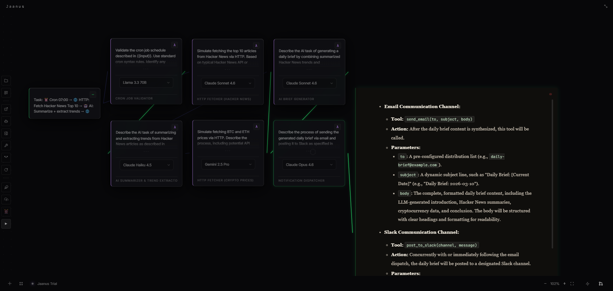

# Jaanus

**Self-hosted AI agent dashboard. Vibe code, automate, and build — powered by Claude, Gemini, GPT-4, and more.**

---

## What is Jaanus?

Jaanus is a self-hosted AI agent dashboard that runs locally on your machine or as a web app. Connect your own API keys, build full-stack apps from a single prompt, automate workflows visually, and keep full control of your data.

No subscriptions. No vendor lock-in. Your keys, your data, your server.

---

## Features

**Vibe Builder**
Generate complete web apps, landing pages, and UIs from natural language. Browse the output live in-app, export as ZIP, or deploy instantly.

**Flow Editor**
Visual drag-and-drop automation with 9 node types — AI, HTTP, code, conditions, loops, and more. No-code pipelines for complex multi-step tasks.

**Multi-Provider LLMs**
Switch between Claude (Anthropic), Gemini, GPT-4, Groq, xAI Grok, Mistral, DeepSeek, and OpenRouter — mid-conversation if you want.

**Plugin System**
Terminal execution, email (read/send), browser control via Playwright, calendar, and custom plugins. Full sandboxing support.

**Agent Memory**
Persistent facts, decisions, and patterns across sessions — with UserModel, Milestones, and Conflict Detection. View and edit all memories in the Brain Memory UI panel.

**Desktop App Builder**
Describe a desktop app → Jaanus generates a full Electron project. Live preview, Export ZIP, Run directly.

**CommandFolio**
One panel for everything: API keys, model settings, plugins, flows deployment, skills, and the plugin marketplace.

---

## Download

| Platform | Link |
|----------|------|
| Windows (x64) | [Jaanus Setup 1.1.0-preview.1.exe](https://github.com/JaanIQ/jaanus-releases/releases/tag/v1.1.0-preview.1) |
| macOS | Coming soon |
| Linux | Coming soon |

**Or try instantly — no install needed:** [jaanus.app](https://jaanus.app)

---

## Quick Start

1. Download and run the installer
2. Open `http://localhost:3000` in your browser
3. Add your API key (Claude, Gemini, or any supported provider)
4. Start building

---

## Tech Stack

- **Backend:** Node.js + Express + WebSocket
- **Frontend:** React + Vite (deployed), Electron (desktop)
- **AI:** Anthropic Claude, Google Gemini, OpenAI, Groq, xAI, Mistral, DeepSeek
- **Automation:** Playwright (browser), node-cron (scheduling)
- **Build:** electron-builder

---

## License

Private — all rights reserved. Web version available at [jaanus.app](https://jaanus.app).

---

  Built with Claude Code · <a href="https://jaanus.app">jaanus.app</a>

